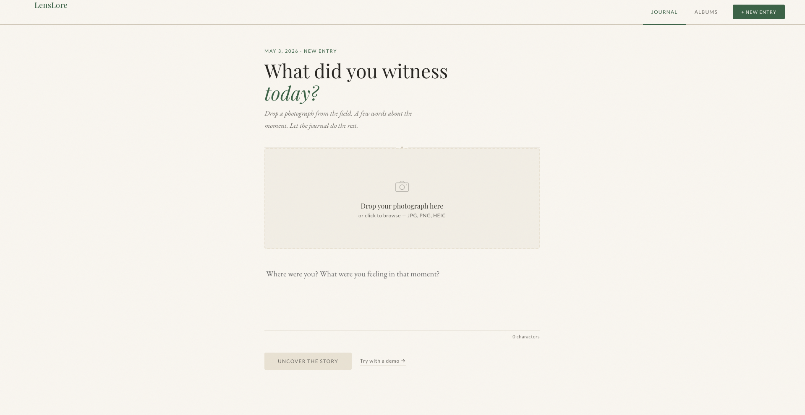
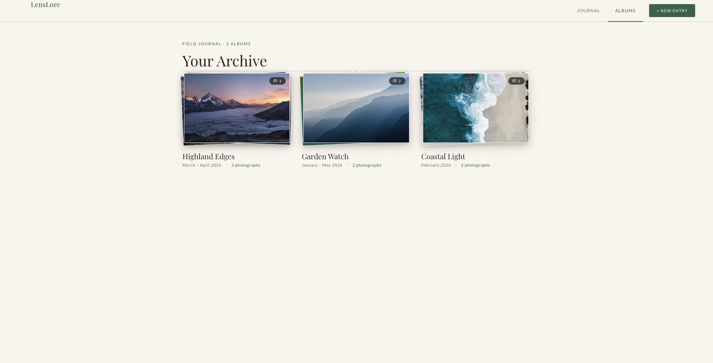

# LensLore

A personal photo storytelling app for nature photographers. Upload a photograph, write a few lines about where you were and what you were feeling, and LensLore generates a cinematic, literary, full-page story experience where the photo's actual colours bleed outward across the screen.


---

## Screenshots





---

## Architecture

```
┌──────────────────────────────────────────────────────────────┐
│                     Aurelia 2 Frontend                        │
│  Journal → Albums → Album Detail → Cinematic Story Page       │
└─────────────────────────┬────────────────────────────────────┘
                          │ HTTPS (JSON)
┌─────────────────────────▼────────────────────────────────────┐
│                     Symfony 6 API                             │
│  POST /api/photos   GET /api/albums   POST /api/albums/{id}   │
└──────────┬───────────────────────────────────┬───────────────┘
           │ AWS SDK                           │ Doctrine ORM
┌──────────▼──────────┐          ┌─────────────▼──────────────┐
│   AWS Lambda (TS)   │          │   PostgreSQL on RDS         │
│  story-generator    │          │   Albums, Photos, Stories   │
│  go-deeper-chat     │          └────────────────────────────┘
└──────────┬──────────┘
           │ Anthropic SDK
┌──────────▼──────────┐          ┌───────────────────────────┐
│   Claude Sonnet 4   │          │   AWS S3                  │
│   Vision + Text     │          │   Image Storage            │
└─────────────────────┘          └───────────────────────────┘
                                 ┌───────────────────────────┐
                                 │   CloudFront CDN           │
                                 │   Image Delivery           │
                                 └───────────────────────────┘
```

---

## Repository Structure

```
/lenslore
├── frontend/          Aurelia 2 + TypeScript — all four screens
├── backend/           Symfony 6 + PHP 8 API
├── lambdas/           TypeScript Lambda functions (story gen, chat)
├── infrastructure/    Terraform — S3, RDS, Lambda, CloudFront, IAM
├── docs/              Architecture decisions
└── README.md          This file
```

---

## Screens

| Screen | Route | Description |
|--------|-------|-------------|
| Journal (Upload) | `/` | Drag-and-drop upload + reflective note input |
| Albums | `/albums` | Stacked photo-pile cards, hover tilt-spread |
| Album Detail | `/albums/:id` | Photo thumbnail grid |
| Cinematic Story | overlay | AI-designed full-page spread with image-colour bleed |

---

## Setup

### Prerequisites

- Node.js 20+
- PHP 8.2+, Composer
- AWS CLI + credentials configured
- Terraform 1.9+

---

### Frontend (`/frontend`)

```bash
cd frontend
npm install
npm run dev          # http://localhost:3000
npm run build        # production build → dist/
npm test             # Vitest (21 tests)
npm run coverage     # coverage report
```

The frontend runs fully on seeded demo data before the backend is wired — all four screens are navigable out of the box.

---

### Backend (`/backend`) — Phase 2

```bash
cd backend
composer install
cp .env.example .env   # fill in DB + AWS credentials
php bin/console doctrine:migrations:migrate
symfony serve          # http://localhost:8000
php bin/phpunit        # PHPUnit suite
```

---

### Lambdas (`/lambdas`) — Phase 3

```bash
cd lambdas
npm install
npm run build          # esbuild → dist/
npm test               # Vitest
```

Deploy via Terraform (see below). The Lambda functions require `ANTHROPIC_API_KEY` set in the Lambda environment.

---

### Infrastructure (`/infrastructure`) — Phase 4

```bash
cd infrastructure
./bootstrap.sh                              # one-time: creates the Terraform state bucket
terraform init
terraform workspace new dev                 # or `select dev` if it already exists
terraform plan -var-file=env/dev.tfvars
terraform apply -var-file=env/dev.tfvars
```

Outputs: S3 bucket name, RDS endpoint, Lambda ARNs, CloudFront domain. Pass `TF_VAR_anthropic_api_key=sk-ant-…` to populate the Lambda secret at apply time. See [`infrastructure/README.md`](infrastructure/README.md) for the full operator guide.

---

## Image-colour Bleed Effect

The signature visual feature on the cinematic story page and fullscreen photo view:

- A blurred, upscaled copy of the same image is absolutely positioned behind the original
- `filter: blur(60px) saturate(1.35) brightness(0.85)` extends the photo's actual colours outward
- A soft `radial-gradient` vignette fades the bleed into the dark page background
- Canvas-based dominant-colour sampling (`src/services/image-colors.ts`) derives the page background from the photo's own pixel data

`prefers-reduced-motion` is respected: all animations are disabled and elements remain at full opacity.

---

## Lambda Contract

**story-generator — input**

```json
{
  "imageBase64": "...",
  "userNote": "Standing on the ridge above Torridon...",
  "mood": "contemplative"
}
```

**story-generator — output (`DesignSpec`, matches the frontend interface field-for-field)**

```json
{
  "palette": {
    "bg": "#1a1f2e",
    "fg": "#F5EFE4",
    "accent": "#7a9fc4",
    "muted": "rgba(245,239,228,0.78)"
  },
  "layout": "centered-stacked",
  "headingFont": "Playfair Display",
  "motif": "horizon-rule",
  "title": "The Ridge at Dawn",
  "caption": "Cloud inversion below, silence above.",
  "mood": "contemplative"
}
```

**go-deeper — input / output**

```json
// input
{
  "photoId": "abc123",
  "photoContext": { "title": "...", "caption": "...", "mood": "...", "note": "..." },
  "conversationHistory": [{ "role": "user", "content": "..." }],
  "newMessage": "Tell me what you see in the silence."
}

// output
{ "reply": "..." }
```

---

## Quality

- TypeScript strict mode, zero `any` types
- PHPStan level 8 (backend)
- All tests written alongside features, not after
- All AWS resources defined in Terraform — nothing created via console
- `prefers-reduced-motion` respected throughout
- Text contrast: warm cream at 78% opacity minimum on dark backgrounds
- Semantic HTML, accessible markup
